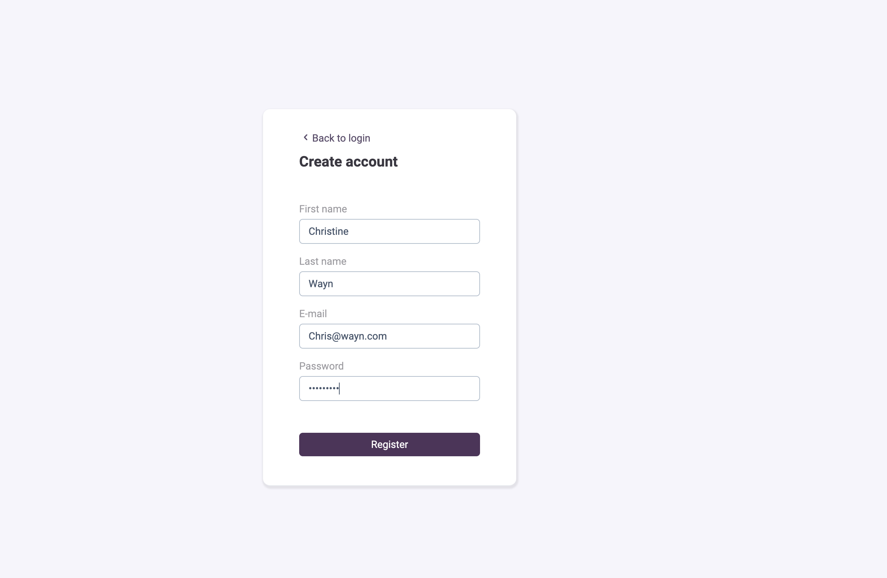
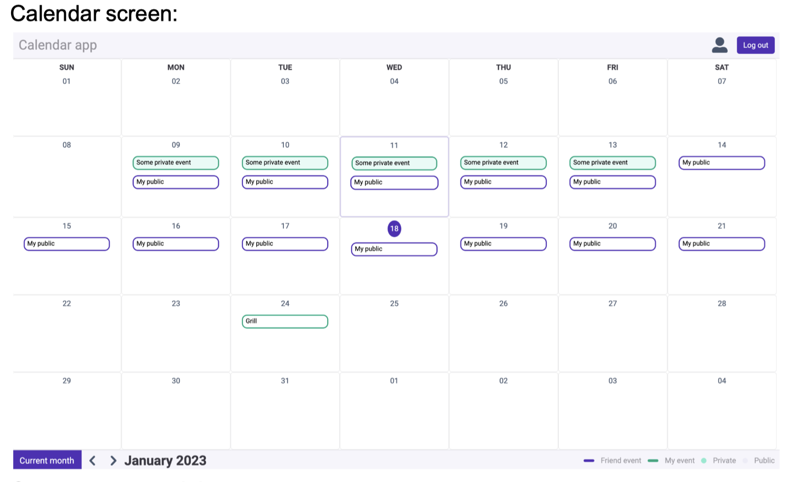
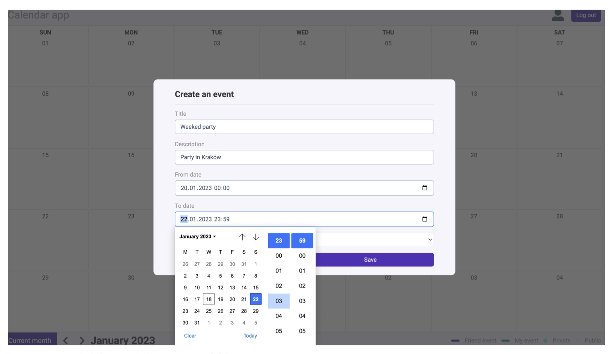

# React Calendar Application

A full-stack calendar application developed as part of the **Design Patterns** course and **Individual Project** at *Jagiellonian University, 2023*. This project showcases advanced design patterns inspired by *Martin Fowler* and includes examples of modern frontend and backend technologies.

## Features

- **Advanced Design Patterns**: Implements well-known patterns to promote clean, maintainable code.
- **Apollo Client**: Utilizes Apollo Client to communicate with a GraphQL server.
- **Styled Components**: Customizes styling with Styled Components for modular and reusable styles.

The application integrates with a server written in Python, available [here](https://github.com/KWaniova/CalendarAppServer).

## Getting Started

This project was initialized with [Create React App](https://github.com/facebook/create-react-app).

### Prerequisites

- **Node.js** and **Yarn**: Ensure that you have Node.js and Yarn installed to manage dependencies and run the application locally.

### Installation

1. Clone the repository:
   ```bash
   git clone https://github.com/KWaniova/CalendarOfEventsApp.
   cd CalendarOfEventsApp
   ```

2. Install dependencies:
   ```bash
   yarn install
   ```

3. Start the application:
   ```bash
   yarn start
   ```

The app will be served in development mode. Open [http://localhost:3000](http://localhost:3000) in your browser to view it. The page will auto-reload if you make edits, and any lint errors will be displayed in the console.

## Additional Resources

- [Create React App Documentation](https://facebook.github.io/create-react-app/docs/getting-started)
- [React Documentation](https://reactjs.org/)
- [Apollo Client Documentation](https://www.apollographql.com/docs/react/)
- [Styled Components Documentation](https://styled-components.com/docs)


## Application Preview
User is able to register and login to the application. After logging in, user can create, edit and delete events. User can also view events in a calendar view.

There are two types of events user sees in the calendar:
- **Personal Events**: Events created by the user.
- **Public Events**: Events created by other users.

User can create, edit and delete only personal events. User can view public events but cannot edit or delete them.

User can also add other users to their friends list. User can view their friends' events in the calendar view.

User can request connection with other users. User can accept or reject connection requests.



